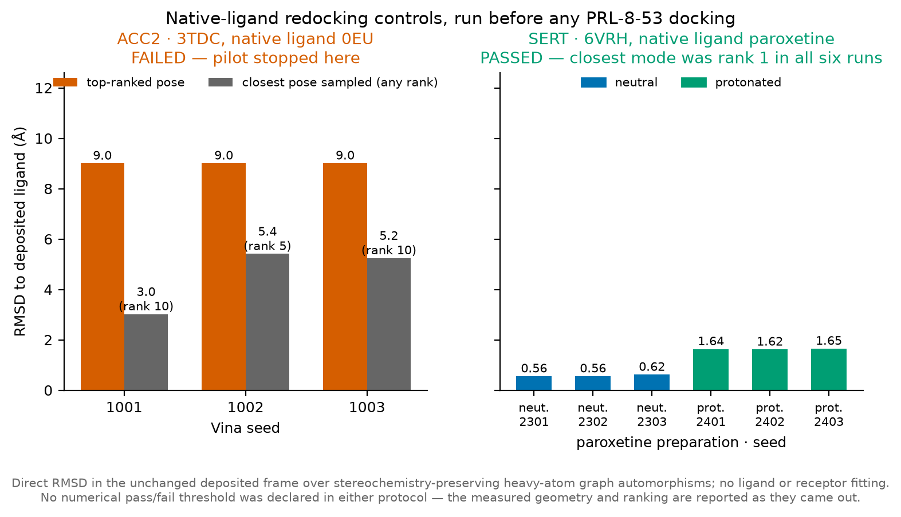
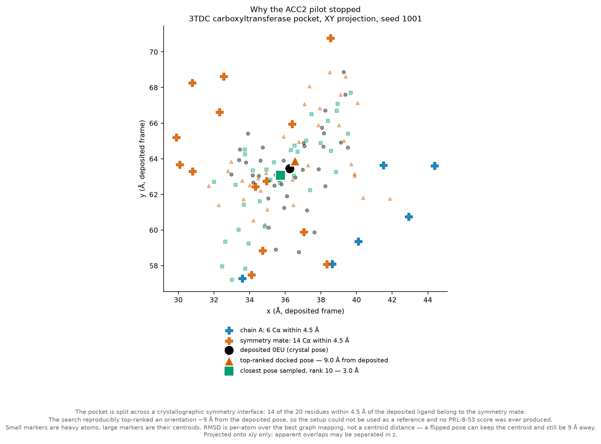
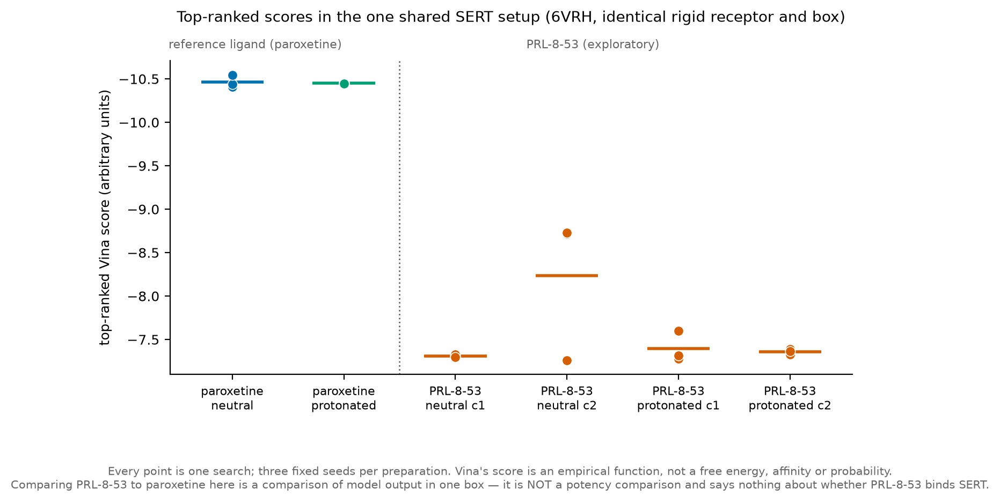

# PRL-8-53 target hypotheses

An evidence audit and controlled docking study of PRL-8-53 target hypotheses, with no established binding target.

## Why this exists

Historical behavioral reports do not identify a molecular target for PRL-8-53. This project separates measured evidence, predictions about other compounds, and docking model output. It records failed controls instead of treating a docking score as a binding result.

## What it shows

- No measured PRL-8-53 binding target was found in the bounded, retained evidence. That is not proof that no measurement exists anywhere.
- ACC2 was the leading computational prediction. Its 3TDC native-ligand control failed across three seeds. Top-ranked poses were 9.0039 to 9.0090 Å from the deposited ligand. Work stopped before any PRL-8-53/ACC2 docking.
- SERT's 6VRH paroxetine control recovered the deposited geometry. In six searches, the closest pose was rank 1: 0.56 to 0.62 Å for neutral preparations and 1.62 to 1.65 Å for protonated preparations.
- Exploratory PRL-8-53 docking in that same SERT receptor used two charge states, two starting conformers, and three seeds. It retained 12 searches, 240 modes, and 14,280 within-state pairwise RMSDs. The poses varied with preparation. They do not establish SERT binding.

The result tables and interpretation are in [exp-002](research/experiments/exp-002/results.md), [exp-003](research/experiments/exp-003/results.md), and [exp-004](research/experiments/exp-004/results.md).





The ACC2 site spans a crystallographic symmetry interface. Fourteen of twenty residues within 4.5 Å of the deposited ligand belong to the symmetry mate. Both receptor chains were retained. This geometry does not establish the cause of the failed control, and the failed setup does not exclude PRL-8-53 binding to ACC2.



These are model scores in one receptor and box, not affinities or a potency comparison. [Figure 3](figures/fig3-prl-pose-variability.png) shows the variability of top-ranked PRL-8-53 poses.

## Run from a clean clone

Figure generation needs Python 3.11 or newer and `uv`. Dependency installation needs a network connection. The script reads retained data and replaces four PNGs and four SVGs in `figures/`. It has no output-directory flag. SVG dates and element IDs can change on each run.

From a clean clone, run:

```sh
uv sync --frozen
uv run --frozen scripts/make_figures.py
```

### Replay saved-pose analysis

The following commands use the recorded Python 3.13 analysis stack. RDKit and gemmi are not in the project lock. `--with` supplies them for these commands without changing project dependencies. Installation needs network access. Analysis itself needs no Vina binary, GPU, paid account, credentials, or network.

Run from the repository root. These scripts overwrite retained tables and summaries under each experiment's `tables/` and `derived/`. They have no output-directory flags. Use a disposable working tree for replay. Do not treat regenerated files as new search evidence.

```sh
export OMP_NUM_THREADS=1 OPENBLAS_NUM_THREADS=1 MKL_NUM_THREADS=1
export VECLIB_MAXIMUM_THREADS=1 NUMEXPR_NUM_THREADS=1

uv run --frozen --with rdkit==2026.03.6 --with gemmi==0.7.5 --with numpy==2.5.3 \
  research/experiments/exp-002/scripts/analyze_native_redocking.py
uv run --frozen --with rdkit==2026.03.6 --with gemmi==0.7.5 --with numpy==2.5.3 \
  research/experiments/exp-003/scripts/analyze_results.py
uv run --frozen --with rdkit==2026.03.6 --with gemmi==0.7.5 --with numpy==2.5.3 \
  research/experiments/exp-004/scripts/analyze_results.py

for exp in exp-002 exp-003; do
  uv run --frozen --with rdkit==2026.03.6 --with gemmi==0.7.5 --with numpy==2.5.3 \
    research/experiments/$exp/scripts/validate_outputs.py
done
```

Exp-004 has a known inventory mismatch in the retained public tree. Its original validator exits nonzero and overwrites `derived/validation.json` with the failed check. The archived passing report is historical, not a claim that validation currently passes. This diagnostic is separate from the successful replay steps:

```sh
uv run --frozen --with rdkit==2026.03.6 --with gemmi==0.7.5 --with numpy==2.5.3 \
  research/experiments/exp-004/scripts/validate_outputs.py
```

The recorded nice-value deviation (20 instead of 19) is separate from the inventory failure. See [the release note](docs/release-review.md). Inputs and historical reports have not been rewritten to make this check pass.

### Evidence checks

Run these before replay, or after returning regenerated tracked files to their published contents. `shasum` is required. Checksums verify published bytes, not scientific truth or presearch chronology.

```sh
uv run --frozen research/alternative-coordinate-evidence/scripts/validate_evidence.py \
  --evidence research/alternative-coordinate-evidence
uv run --frozen research/alternative-structure-evidence/reviewed-evidence-check.py

for sums in research/alternative-*-evidence/SHA256SUMS research/experiments/exp-*/SHA256SUMS; do
  (cd "$(dirname "$sums")" && shasum -a 256 -c SHA256SUMS)
done
```

### Optional Vina searches

The offline commands above do not rerun docking or regenerate ligand preparations. The original searches used AutoDock Vina 1.2.7, RDKit 2026.03.6, Meeko 0.8.0, gemmi 0.7.5, NumPy 2.5.3, SciPy 1.18.1, and Python 3.13. The recorded Vina binary is the macOS arm64 release, SHA-256 `823c2bbacf26d72183861322345f0a89736aca66c8e81054c66f93af5ad623f1`.

The Vina binary and preparation environment are not vendored or fully locked. Original command records exist for [exp-003](research/experiments/exp-003/commands.md) and [exp-004](research/experiments/exp-004/commands.md). Exp-002 has scripts and logs, but no `commands.md`. These are historical reconstruction records, not portable copy-paste rerun instructions. Fixed seeds alone do not guarantee identical output across platforms. Do not overwrite the retained search evidence to try a new preparation.

## Project layout

| Path | Contents |
|---|---|
| `scripts/make_figures.py`, `figures/` | Figure generator and published PNG/SVG panels |
| `manuscript/` | Unpublished manuscript draft, claim ledger, and readiness gaps |
| `docs/target-shortlist.md`, `docs/process/` | Candidate shortlist and dated scientific plans |
| `research/identity-and-evidence.md`, `research/evidence-sources.md` | Compound identity and bounded literature/database review |
| `research/*-evidence/` | Small retained source records, retrieval metadata, and evidence checks |
| `research/experiments/exp-001/` | Prediction summary, source-compound trace, and ChEMBL records |
| `research/experiments/exp-002/` | Failed ACC2 control, scripts, prepared inputs, poses, tables, and logs |
| `research/experiments/exp-003/` | SERT reference control and its protocol and command record |
| `research/experiments/exp-004/` | Exploratory PRL-8-53/SERT poses and their analysis |
| `DATA-SOURCES.md`, `LICENSE`, `LICENSE-docs`, `CITATION.cff` | Source attribution, license scopes, and repository citation |

Exp-002 through exp-004 have `scripts/`, `inputs/`, `derived/`, `poses/`, `logs/`, and `tables/`. Exp-001 instead has `raw_data/`, `inputs.json`, and a source trace. Every experiment has a manifest, result report, and `SHA256SUMS`.

### Data and release provenance

Small source snapshots and saved poses are retained because they support the reported result and offline replay. They are not a bulk dataset. New downloads, datasets, environments, secrets, and generated runs belong in ignored `data/`, `datasets/`, or `.local-tools/`. Do not add private data or service exports.

[DATA-SOURCES.md](DATA-SOURCES.md) identifies the archives and licenses. Retrieval scripts for coordinate evidence accept `--out`, so new downloads can go to `.local-tools/coordinate-evidence/`. Original URLs, retrieval times, and hashes are in the source manifests and response sidecars. Experimental maps and inaccessible historical full texts are not present. SwissTargetPrediction exports and service pages are intentionally not redistributed. Withdrawn AI-generated literature summaries are not restored.

Published file manifests and checksums were refreshed after documentation cleanup and log removal. Historical source and presearch inventories remain unchanged. [The release note](docs/release-review.md) explains the exp-004 mismatch and the current check results.

## Limits and known gaps

- No retained result establishes a PRL-8-53 binding target, efficacy, selectivity, or safety. This is research software, not medical advice.
- The literature review was bounded. The 1978 human study was read as an abstract; the 1974 report was available as citation metadata only.
- Service predictions cannot be independently replayed from this tree. The [claim ledger](manuscript/claim-ledger.md) distinguishes retained calculations and records from unavailable service material and internal review statements. It is not a promise that every claim has a retained primary source.
- The receptor models were rigid and stripped. Waters, sodium, chloride, missing segments, and incomplete residues limit interpretation. Experimental maps were not inspected.
- No compound-specific experimental pKa was found. Charge and starting geometry both differ across preparations, so pose differences cannot be attributed to charge alone.
- No numerical pass threshold was declared in the completed docking protocols. Native-pose recovery checks a setup, not an unknown ligand.
- Only figure dependencies are locked. Saved-pose analysis uses recorded package versions. Original search/preparation reconstruction remains manual and platform-specific.
- Manuscript contributions and final submission declarations still need Rolf's review. Internal AI-assisted review is not external peer review.

## How this was built

AI coding agents did much of the implementation, analysis scripting, search execution, and draft writing under Rolf's direction. Rolf chose the protocols and native-ligand validation gates, and decided to stop the ACC2 pilot when its control failed. The recorded review checked identities, source provenance, coordinate mappings, saved-pose analyses, and inventories. It also identified and withdrew generated summaries that were not primary literature. These checks are internal, not independent expert approval. Rolf remains responsible for reviewing the scientific claims and the final public release.

## License and citation

- Code: MIT, see [LICENSE](LICENSE).
- Original documentation, figures, and generated analysis tables, summaries, and pose outputs: CC BY 4.0, see [LICENSE-docs](LICENSE-docs). Third-party content and adaptations keep the applicable source terms, including ChEMBL's share-alike terms. See [DATA-SOURCES.md](DATA-SOURCES.md).
- Cite the repository with [CITATION.cff](CITATION.cff). The manuscript is an unpublished draft, not an externally reviewed paper or a published preprint. No paper or preprint DOI is asserted.
